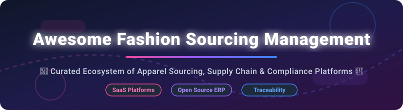

<p align="center">
  
</p>

# 👔 Awesome Fashion Sourcing Management 🧵

<p align="center">
  <a href="https://github.com/ishandutta2007/Awesome-Awesome-Awesome"></a><a href="https://discord.gg/jc4xtF58Ve"></a>
  <a href="https://github.com/ishandutta2007/Awesome-Fashion-Sourcing-Management/stargazers"></a>
  <a href="https://github.com/ishandutta2007/Awesome-Fashion-Sourcing-Management/network/members"></a>
  <a href="https://github.com/ishandutta2007/Awesome-Fashion-Sourcing-Management/issues"></a>
  <a href="https://github.com/ishandutta2007/Awesome-Fashion-Sourcing-Management/blob/main/LICENSE"></a>
  <a href="https://github.com/ishandutta2007"></a>
</p>

## 🌟 Top Fashion Sourcing Management Platforms Ecosystem

**Curated List of SaaS Products & Open-Source GitHub Projects**

*Focused on Apparel Sourcing, Supplier Collaboration, Quality Control, Compliance Tracking, Sustainability Traceability & Global Supply-Chain Visibility*

**📅 Last updated: September 2026**

---

### 🚀 Overview

This repository tracks notable **SaaS platforms** and **open-source software** for **Fashion Sourcing Management**, **Apparel Supply Chain Management**, **Vendor Management Systems (VMS)**, and **Product Lifecycle Management (PLM)** integrations. These digital tools empower apparel, footwear, luxury, and soft-goods brands to streamline supplier onboarding, RFQs/RFPs, techpack sharing, sample approval milestones, purchase order (PO) tracking, factory quality inspections, ESG compliance audits, and multi-tier supply-chain visibility.

**Category Leaders Include:** Infor Nexus, Assent, Resilinc, Sedex, Inspectorio, Zetwerk, TradeBeyond, Pivot88, Sourcemap, and WFX Sourcing.

**💡 Open-Source Emphasis:** Dedicated fashion sourcing and multi-tier compliance platforms remain predominantly commercial. Practical open-source options consist of enterprise ERP supplier modules (**Odoo**, **ERPNext**), supply chain event tracking tools (**Apache Unomi**, **Hyperledger Fabric**), blockchain transparency engines, and community textile datasets.

---

## 📑 Table of Contents

- [🏢 SaaS & Commercial Hosted Platforms](#-saas--commercial-hosted-platforms)
- [🔓 Open-Source GitHub Projects](#-open-source-github-projects)
- [🛠️ Architecture & Custom Implementation Frameworks](#%EF%B8%8F-architecture--custom-implementation-frameworks)
- [🤝 How to Contribute](#-how-to-contribute)
- [💖 Support & Community](#-support--community)
- [📈 Star History](#-star-history)
- [⚠️ Disclaimer](#%EF%B8%8F-disclaimer)

---

## 🏢 SaaS & Commercial Hosted Platforms

> [!NOTE]
> **Market Dynamics & Industry Size:**
> The global fashion sourcing, PLM, and supply chain management software market is estimated at **~$3.2 Billion (2026)** and is projected to reach **$5.8 Billion by 2030**. The sector is **moderately fragmented**, featuring massive enterprise supply network leaders alongside specialized vertical point solutions in quality control, ESG traceability, and supplier collaboration.

### 📊 Comparative Analysis of SaaS Sourcing Platforms

*Sorted by Company Scale / Enterprise Footprint (Descending)*

| Platform | Enterprise Scale / Valuation / Revenue | Starting Pricing Tier | Free Tier / Trial Limit | Key Focus & Features |
| :--- | :--- | :--- | :--- | :--- |
| **[Infor Nexus](https://www.infor.com/products/nexus)** | **$3.2B+ Annual Revenue** (Koch Industries subsidiary) | $15,000/year base platform licensing | 30-day enterprise sandbox preview (by request) | Multi-enterprise global supply chain network, real-time PO execution, automated multi-tier logistics & financial flows. |
| **[Assent](https://www.assent.com/)** | **$1.2B+ Valuation** ($350M+ total raised) | $10,000/year enterprise compliance suite | 14-day vendor demonstration trial environment | Supply chain sustainability, REACH/RoHS regulatory compliance, supply chain ESG risk management. |
| **[Resilinc](https://www.resilinc.com/)** | **$500M+ Valuation** (Private equity backed) | $8,500/year risk monitoring module | Free supplier portal account (limited to receiving customer requests) | Multi-tier supply chain mapping, AI disruption monitoring, supplier risk resiliency analytics. |
| **[Sedex](https://www.sedex.com/)** | **$75M+ Annual Revenue** (Non-profit trade association body) | £110/year (~$140/yr) buyer membership | Free 14-day preview access for verified supplier accounts | SMETA audit sharing, ethical trade risk assessment, global labor compliance tracking network. |
| **[Inspectorio](https://www.inspectorio.com/)** | **$50M+ Annual Revenue** ($50M+ Series B funding) | $500/month per factory facility | 14-day trial account for quality management module | Factory quality control, digitized inspection workflows, production risk monitoring & analytics. |
| **[Zetwerk Supplier Portal](https://www.zetwerk.com/)** | **$2.7B Valuation** (Unicorn status) | $450/month starter sourcing manager plan | Free supplier profile registration (no buyer RFQ publishing limits) | Global contract manufacturing portal, B2B custom apparel sourcing, quote management & production tracking. |
| **[TradeBeyond](https://www.tradebeyond.com/)** | **$40M+ Annual Revenue** (Private equity backer: EQT) | $400/month per user module license | 14-day guided trial environment | Retail & fashion sourcing software, RFQ automation, line building, supplier collaboration & PO execution. |
| **[Pivot88](https://www.pivot88.com/)** | **$25M+ Annual Revenue** (Acquired by TradeBeyond / EQT) | $350/month per quality inspection user | 30-day trial for quality management mobile app | Quality assurance, sample tracking, factory audit digitization, raw material inspection workflows. |
| **[Sourcemap](https://www.sourcemap.com/)** | **$20M+ Annual Revenue** ($20M+ Series B funding) | $300/month tier 1 mapping license | Free basic supplier disclosure portal | Supply chain transparency, multi-tier fabric/raw material tracing, forced labor compliance verification. |
| **[WFX Sourcing](https://www.worldfashionexchange.com/)** | **$15M+ Annual Revenue** (Bootstrapped / Profitable) | $150/user/month (min 5 users = $750/mo) | 14-day full platform trial demo | End-to-end apparel cloud PLM & ERP sourcing module, techpack management, costing & vendor portal. |

---

## 🔓 Open-Source GitHub Projects

Below is a curated collection of open-source software, ERP modules, supply-chain event trackers, and data standards suitable for building custom fashion sourcing solutions.

*Sorted by GitHub Stars_Count (Descending)*

| Repository & Link | GitHub_Stars_Badge | Description & Sourcing Application |
| :--- | :--- | :--- |
| **[Odoo Purchase & Vendor Management](https://github.com/odoo/odoo)** | [](https://github.com/odoo/odoo/stargazers) | Enterprise Open Source ERP containing comprehensive RFQ, Purchase Order, Vendor Onboarding, and Bill of Materials (BOM) modules customizable for garment sourcing. |
| **[ERPNext Buying & Supplier Portal](https://github.com/frappe/erpnext)** | [](https://github.com/frappe/erpnext/stargazers) | Modern open-source ERP with built-in supplier portal, material request workflows, multi-currency purchasing, and apparel inventory management. |
| **[Hyperledger Fabric](https://github.com/hyperledger/fabric)** | [](https://github.com/hyperledger/fabric/stargazers) | Enterprise permissioned blockchain framework widely utilized for constructing private multi-tier apparel supply chain traceability and provenance tracking network nodes. |
| **[Apache Unomi](https://github.com/apache/unomi)** | [](https://github.com/apache/unomi/stargazers) | Open-source customer & partner event tracking server that can be repurposed for supplier lifecycle event capture and vendor portal analytics. |
| **[OpenLMIS](https://github.com/OpenLMIS/OpenLMIS-UI)** | [](https://github.com/OpenLMIS/OpenLMIS-UI/stargazers) | Open-source Logistics Management Information System framework adaptable for tracking distributed garment allocations, regional inventory movements, and warehouse distribution. |
| **[Tetra Sustainable Traceability](https://github.com/APiligrim/Tetra)** | [](https://github.com/APiligrim/Tetra/stargazers) | Blockchain prototype designed specifically for apparel brands to track sustainable raw material flows, organic fabric certificates, and factory transformation stages. |
| **[Textile Playbook](https://github.com/ayumi-research/textile-playbook)** | [](https://github.com/ayumi-research/textile-playbook/stargazers) | Open knowledge repository, evaluation matrices, and structured data standards for B2B fabric sourcing, embroidery pricing, and mill audits. |
| **[Jaal Yantra Textile Engine](https://github.com/Jaal-Yantra-Textiles)** | [](https://github.com/Jaal-Yantra-Textiles/stargazers) | Open-source textile-first production management platform for micro-factories, covering design spec sheets to mill shipment tracking. |

---

## 🛠️ Architecture & Custom Implementation Frameworks

For fashion brands and engineering teams seeking to build internal custom sourcing solutions:

```
[ Open ERP (Odoo / ERPNext) ]  <--->  [ Supplier Portal (Self-Hosted React/Vue) ]
            │                                             │
            ▼                                             ▼
[ PO & RFQ Execution Engine ]         [ Spec Sheet & Techpack Document Storage ]
            │                                             │
            └──────────────────────┬──────────────────────┘
                                   │
                                   ▼
                   [ Audit & ESG Compliance Layer ]
                                   │
                                   ▼
              [ Multi-Tier Traceability (GS1 EPCIS / Fabric) ]
```

- **Core Procurement & Vendor Master:** Leverage **Odoo** or **ERPNext** for PO lifecycle, vendor onboarding, and costing worksheets.
- **Supplier Collaboration:** Build custom light-weight web portals (React/Next.js) consuming ERP GraphQL API endpoints for sample status updates.
- **Traceability & Compliance:** Implement GS1 EPCIS standards or **Hyperledger Fabric** nodes for tracking organic cotton/polyester certifications across Tier-1 to Tier-4 suppliers.

---

## 🤝 How to Contribute

Contributions are warmly welcomed! Please follow these simple steps:

1. **Fork** the repository.
2. Add your product or project to `README.md` following the table schema.
3. Ensure factual descriptions and verify working official links.
4. Submit a **Pull Request (PR)** with a summary of changes.

---

## 💖 Support & Community

If you find this repository helpful, please consider supporting the project:

- ⭐ **Star** this repository to show your appreciation!
- 🔀 **Fork** it to keep your own copy and contribute improvements.
- 📢 **Share** it with fellow fashion tech engineers, sourcing managers, and supply chain professionals.
- ☕ **Sponsor:** You can buy me a coffee via the [GitHub Sponsor Dashboard](https://github.com/sponsors/ishandutta2007)!

---

## 📈 Star History

[](https://star-history.dera.page/#ishandutta2007/Awesome-Fashion-Sourcing-Management&type=date&legend=top-left)

---

## ⚠️ Disclaimer

- This list is **community-curated** for informational purposes only.
- Supply chain data and vendor pricing structures change frequently. Always consult official vendor sales channels for binding quotes.
- This repository is not legal, financial, or regulatory compliance advice.

---

<p align="center">
  <b>Made with ❤️ for apparel brands, sourcing leaders, and supply chain transparency advocates globally.</b>
</p>
